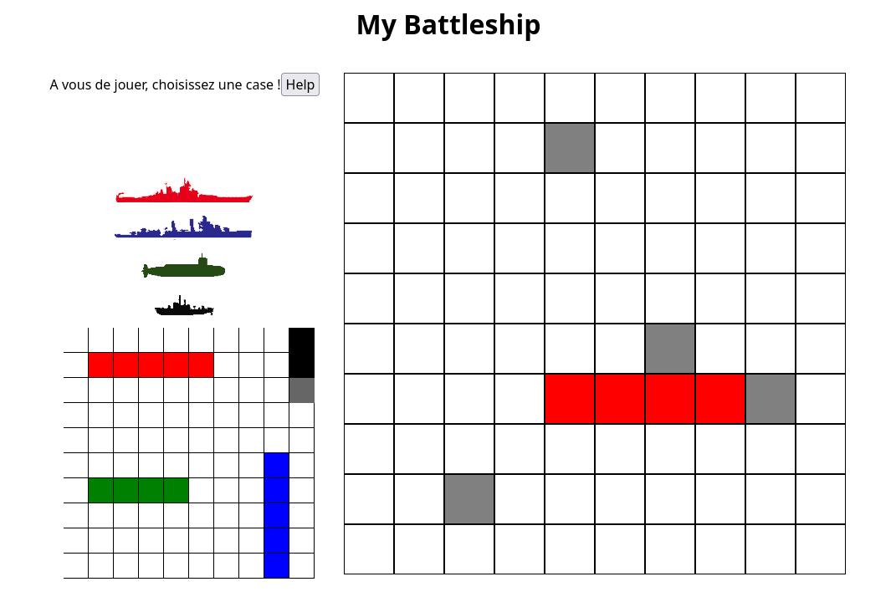

# Battleship

## Introduction

👋 Bienvenue !

Ce projet est un jeu de Bataille Navale développé en deux semaines et par des groupe de deux personnes. L'objectif était de déboguer et d'ajouter de nouvelles fonctionnalités au jeu.

Nous avons mis en place un adversaire IA pour jouer contre vous et ajouté une fonctionnalité d'aide. Le projet a été développé en JavaScript natif.

## Fonctionnalités

- Jouez contre un adversaire IA.
- Obtenez de l'aide en utilisant la fonction d'aide pour trouver les positions des navires ennemis.
- Posez 4 bateaux

## Captures d'écran

